# I enjoy Math and Trading
I've been forward-testing statistical arbitrage trading techniques. The repo is private as a lot of it has information that I don't want shared. However, there is a lot code I want to slowly roll out for people to see regarding its infrastructure. I have some cool optimizations that people can replicate, and also borrow the infrastructure if they want to trade themselves. It's currently written in C++, Python and R, and I use bash to run/schedule commands from an EC2 instance. I love Python but I want to move to a C++/Rust architecture to improve performance. I thought this would be a good medium to share my findings and keep myself accountable
The results are updated every weekday by crontab scheduling on EC2.

## Here are the results so far, 
### note that some may not perform well because I am still in the process of testing.

For pairs, I use statistical arbitrage, which you can read about here: https://en.wikipedia.org/wiki/Statistical_arbitrage. All these gains/losses are from using 1000$ of stock. So if I were trading SPY and SPX, I would go short 1000$ worth of SPY and long 1000$ worth of SPX.I create my own indicator of divergence to measure when to enter and exit trades.

For single stocks, I use normalization to trade the stock at a specific price given the context.
I am randomly choosing 20 graphs everyday, out of hundreds of strategies 

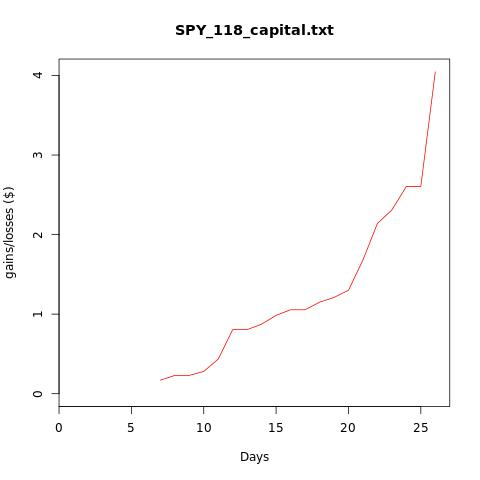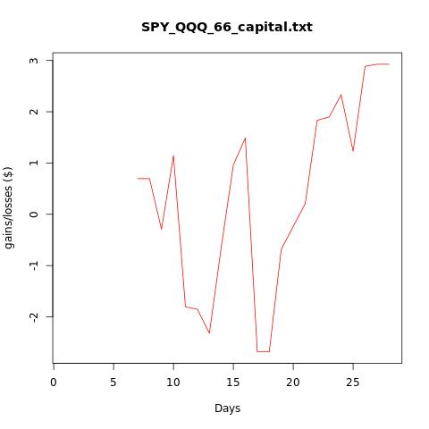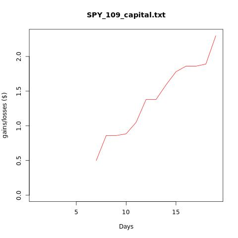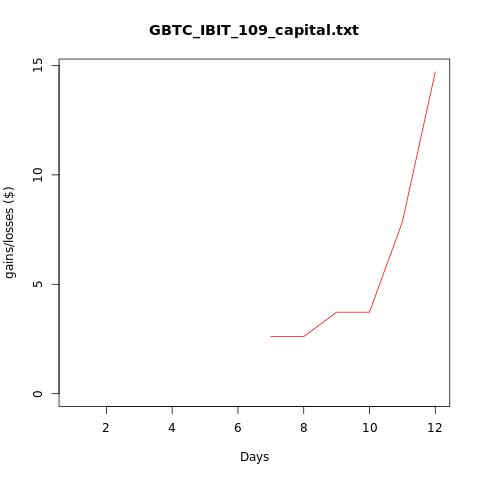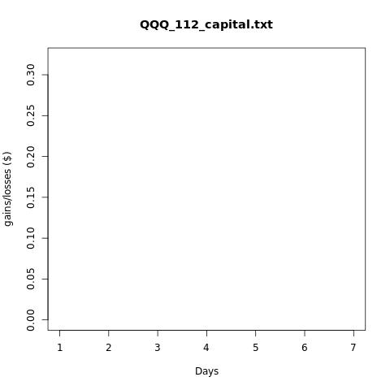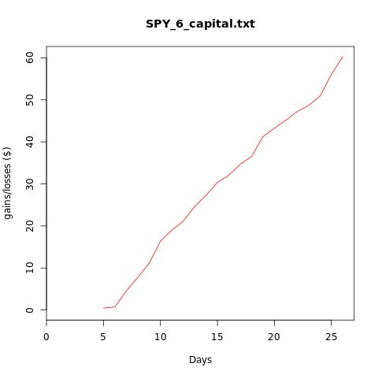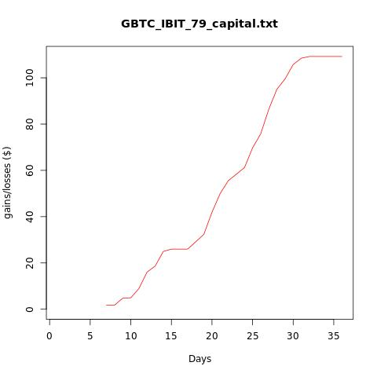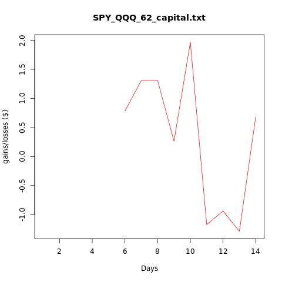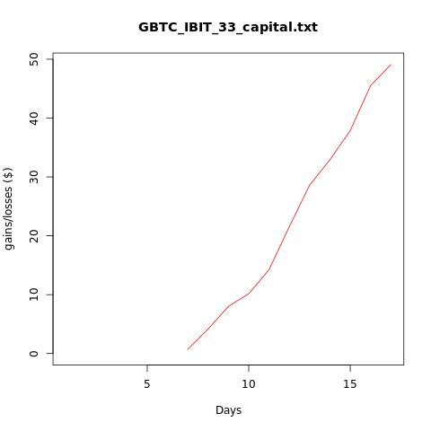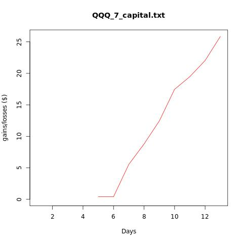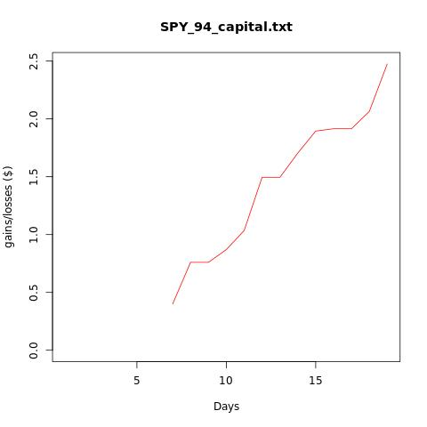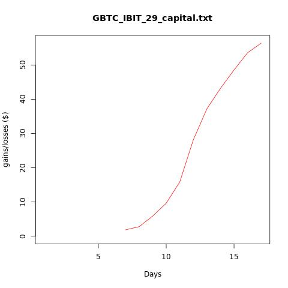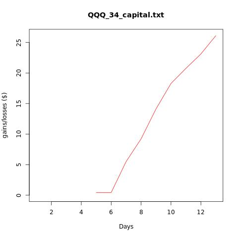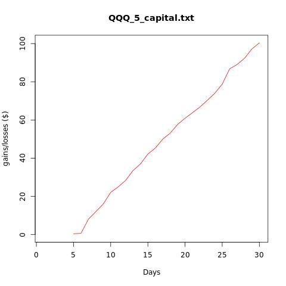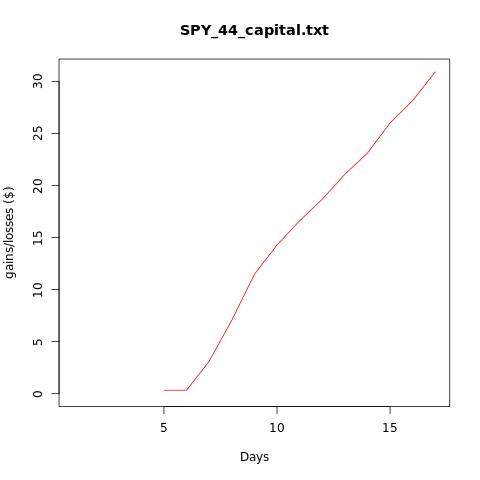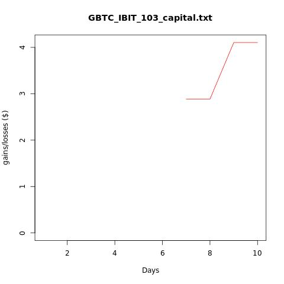

